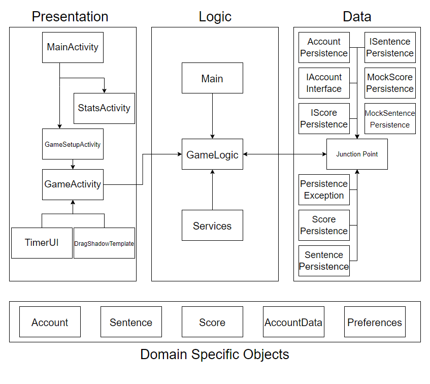

# Architecture

This project uses a 3-tier architecture. UI/Presentation, Logic, and Data.

Presentation is covered primarily by *MainActivity*, *GameUI*, *GameLevelActivity*, and the *LevelActivities* in UI package.

Logic is handled by *GameLogic*, in logic package. It has support from *Main* and *Services* within the application package.

Data is implemented in the *IDatabase* file (in interfaces package), with multiple persistent entries, these being: *AccountPersistence*, *IAccountInterface*, *ISentenceInterface*, *SentencePersistence*, and *MockDatabase*.

Additionally, our domain specific objects are *Account*, *AccountData*, and *Sentence*, (and maybe *Preferences*)

The architecture diagram is a separate image called "ARCHITECTURE_I2.png"

